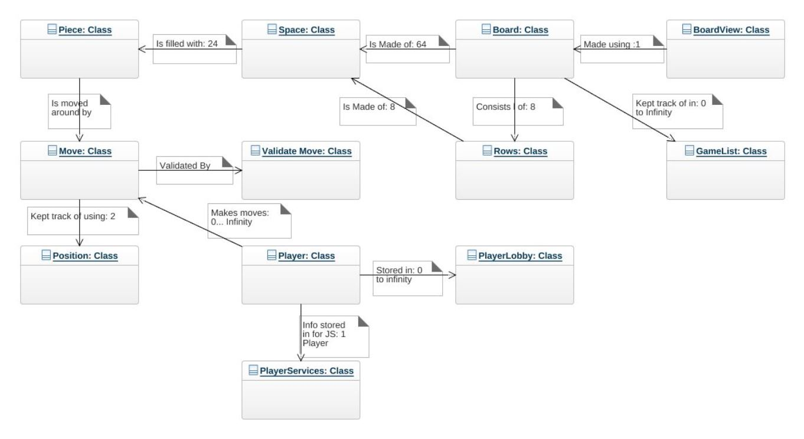
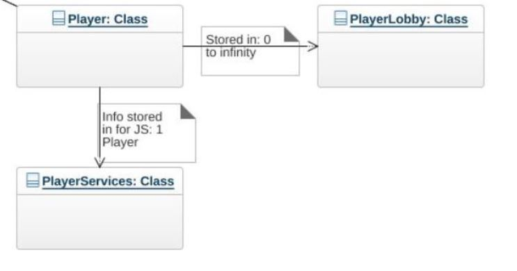
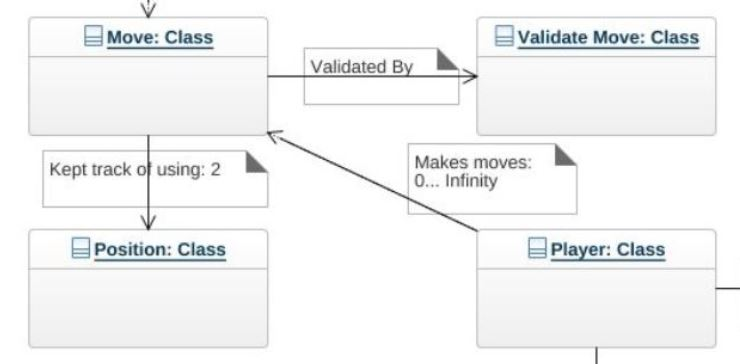
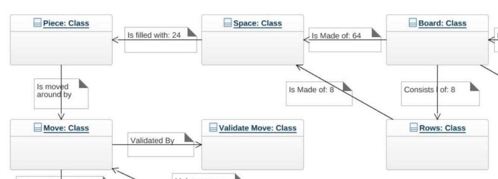
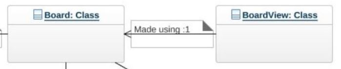
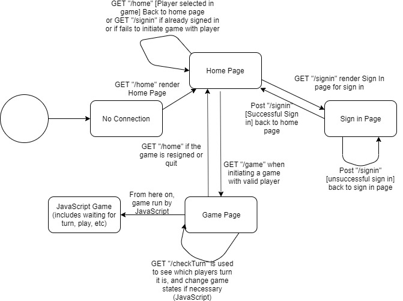
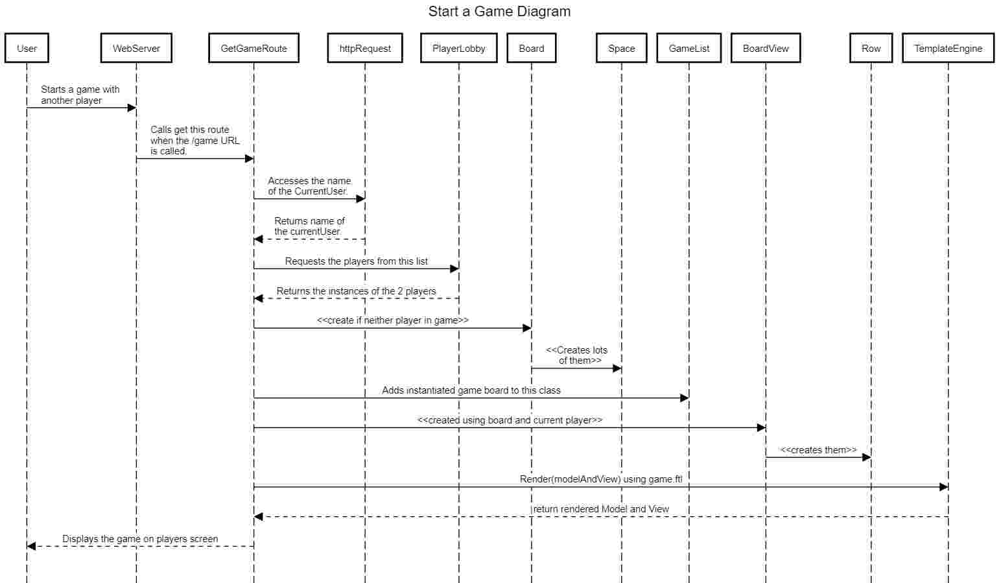

# PROJECT Design Documentation

> _The following template provides the headings for your Design
> Documentation.  As you edit each section make sure you remove these
> commentary 'blockquotes'; the lines that start with a > character
> and appear in the generated PDF in italics._

## Team Information
* Team name: B
* Team members
  * Maggie Lehman
  * Andrew Thompson
  * Trey Pachucki
  * Henry Kenna
  * Michael Tseng

## Executive Summary

The project is webCheckers. This is a web based implementation of the
classic american checkers game.

### Purpose
The purpose of this project is to provide a MVP for the Webcheckers
company in order to prove that an online version of checkers is a
viable product to create.

### Glossary and Acronyms
> _Provide a table of terms and acronyms._

| Term | Definition |
|------|------------|
| VO | Value Object |
| MVP | Minimum Viable Product |

## Requirements

This section describes the features of the application.

The features of this product includes the ability to play a
game of Checkers against an online opponent. This ranges
from the beginning of the game until either one player
wins or resigns. Players should be able to sign in and
challenge another player to a game of checkers, unless one
player is already in a game.

### Definition of MVP
The Minimum Viable Product should be able to play an entire game
of checkers using the American ruleset.

### MVP Features
Login to the Online Game
Start a game against a free opponent (not in game).
Load into the game with the second player
Be able to play a game according to American Rules
Be able to resign and undo moves (before submission)
Be able to move, jump (forced), and perform multiple jumps
Have King pieces be able to be created
Have pieces be able to be captured.

### Roadmap of Enhancements
> _Provide a list of top-level features in the order you plan to consider them._

## Application Domain

This section describes the application domain.

This is the overall domain model for our Webcheckers implementation as it
stands. The model heavily relies on the Board class to keep track of most
of the important information. This is done since it is the one class that
can almost always be accessed, as it's stored in the GameList, which is
always accessible. For ease of digestion, lets further break this domain
model down.

This is the model for how the players exist within the implementation of
WebCheckers. Each Player after creation is stored in the PlayerLobby, so
that the players can be kept track of. In order to communicate with the
Javascript, the players can also be stored in instances of PlayerServices.
The reason behind this design is it allows classes to access the Player
instances required (through PlayerLobby) and allows for the model to
communicate with the Javascript (PlayerServices).

The next logical step from Players is what the players will be doing
primarily, making moves. The Moves are created using instances of
Position. This portion was required by the Javascript provided, as without
doing it this way the Javascript won't work. We then have a Move Validator
which takes in moves and determines if they are legal checkers moves. These
moves can then be made on the users end and submitted if so desired in order
to update the board on both players screens. The reason behind the making of
a move validator was to help decrease the amount of logic and code within the
board class, and to increase the cohesion of the classes.

Moving on from the Moves model, next up is the Board Model. The board is
primarily made up of Rows of Spaces. These spaces are used in order to
keep track of all the Pieces on the board. These pieces could be moved around
by Moves, the model of which was previously discussed. The reason behind this
architecture was so that each class could focus primarily on one task, the Space
focuses on the aspects of each individual space, the rows focuses keeping track
of those spaces, and the Board keep tracks of the rows. Each class further breaks
down the board class so that not all functionality would be taken care of by it.

The visuals model is rather simple. The BoardView takes care of adjusting the
board for visual purposes on each players screen. The reason behind this was
to decrease the number of boards required (possibly needing 2, one for each
player) and decreasing the number of possible points of failure and making
the code easier to understand and maintain.

## Architecture and Design

This section describes the application architecture.

### Summary

The following Tiers/Layers model shows a high-level view of the webapp's architecture.

As a web application, the user interacts with the system using a
browser.  The client-side of the UI is composed of HTML pages with
some minimal CSS for styling the page.  There is also some JavaScript
that has been provided to the team by the architect.

The server-side tiers include the UI Tier that is composed of UI Controllers and Views.
Controllers are built using the Spark framework and View are built using the FreeMarker framework.  The Application and Model tiers are built using plain-old Java objects (POJOs).

Details of the components within these tiers are supplied below.

### Overview of User Interface

This section describes the web interface flow; this is how the user views and interacts
with the WebCheckers application.

The general path of the user is shown in this here statechart. The general
path the user will follow is as follows, they first connect to the home page.
From there, they go to the sign in page to sign in, which then enables them to
see the other players and initiate a game. Once they go to initiate a game,
both players get sent to a game page where they can play a game of checkers.
From there the game state is decided by the javascript, though the page does
check itself using a "checkturns" route in order to see when it's that players
turn.

### UI Tier
The UI tier consists almost entirely of routes that the game follows in order
to function. This includes routes in order to sign in and other routes in
order to have the game function. An example of how one these routes functions
is as follows.

The Route gets called by the users browser first. Upon receipt the webserver sends
the user to the proper route and has that file run. All the different board
associations and game initializations are all from the specifics of the "/game" route
being initiated.

The reason we use this architecture is because it allows us to customize each webpage
with relative ease using different ".ftl" files and also allows us to update
things on the backend (within the server) with relative ease.

The other UI Tier classes are BoardView, which simply adjusts the Board model so it
properly fits which side the user is on, which is needed for the Game UI to properly
render, and WebServer, which handles the rerouting of the server requests. It uses
Spark architecture and Get/Post routes in order get the user to see what they need
to see.

### Application Tier
The Application tier takes care of required housekeeping things, mostly to help
facilitate communication between the model and UI tiers. Things such as keeping
track of the players (PlayerLobby), keeping track of the Games (GameList), and
allow for communication of player data with the Javascript (PlayerServices). Overall
we chose to include a PlayerLobby and a GameList in order to help facilitate
communication between the different classes within the Model tier, the UI tier,
and the Javascript that was provided.

### Model Tier
The Model tier allows us to keep tabs on different objects and to represent
all the information we need in smaller pieces. It allows us to increase cohesion
of the individual classes by decreasing what each one does. For instance,
we have separate classes to handle rows, spaces, and the pieces rather than
making it all one super class. The domain model shown previously outlines this
architecture pretty well, as it was the main architecture that was designed by us
and was the least dictated by the confines of the project as it was given to us.

### Design Improvements
In the future we would like to finish out the MVP and get everything
tested and working. As of now, we don't have tests for all of our branches.
In terms of design, we would like to try to decrease coupling as most UI routes
rely on very specific classes. It would also be optimal to try to incorporate
either an interface or abstract class for the different types of moves, as the
classes tend to be similar.

## Testing
There was testing performed on almost every section of the code so
using junit and mock tests. In most cases we mocked the boared
and the pieces to test the model classes. This allowed us to test
the individual logic of the model classes. We also mocked calls in
the UI. This allowed us to better check that all routes are correctly
called and tested.

### Acceptance Testing
Currently most of our stories in sprint 2 passed unit tests.
This includes :
player turns, sign out, resign, assign teams, king creation, forfeit, able to move pices, and jumps
The stories backwards moves, and multiple jumps are done but still in the testing phase
as they have not yet passed all of their unit test. Our route checking needs better
checking. Our model has very good coverage, however our route testing is still lacking
we will be working on this in sprint 3.

### Unit Testing and Code Coverage
Our unit testing strategy is to have (for the most part) whoever
wrote the code write up the unit tests, as they are most familiar with
how the code functions. We test every function to ensure it works properly,
followed by using a specialized tool in order to tell us our code coverage.
Our goal at this point in time is to have as much code coverage as possible,
with the minimum goal being 80%. The reason we chose this value was because
it allows for some flexibility in what we test, but still requires us to
test the bulk of our code. We currently have a code coverage of 100% based off
of unit tests all running successfully with no failures or errors in tests.